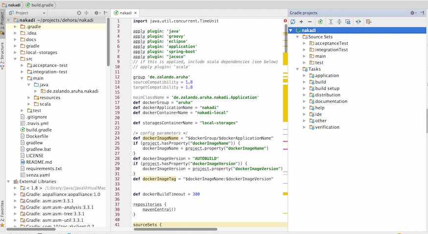

# Building and Developing

## Getting the Code

Nakadi is hosted on Github - [zalando/nakadi](https://github.com/zalando/nakadi/) and you can clone or fork it from there. 

## Building

The project is built with [Gradle](http://gradle.org). 

The `gradlew` [wrapper script](http://www.gradle.org/docs/current/userguide/gradle_wrapper.html) is available in the project's root and will bootstrap the right Gradle version if it's not already installed. 

The gradle setup is fairly standard, the main dev tasks are:

- `./gradlew build`: run a build and test
- `./gradlew clean`: clean down the build

Pull requests and master are built using Travis CI and you can see the build history [here](https://travis-ci.org/zalando/nakadi).

## Running Tests

There are a few build commands for testing -

- `./gradlew build`: will run a build along with the unit tests
- `./gradlew acceptanceTest`: will run the acceptance tests
- `./gradlew fullAcceptanceTest`: will run the ATs in the context of Docker

## Running Containers

There are a few build commands for running Docker -

- `./gradlew startDockerContainer`: start the docker containers and download images if needed.
- `./gradlew stopAndRemoveDockerContainer`: shutdown the docker processes
- `./gradlew startStoragesInDocker`: start the storage container that runs Kafka and PostgreSQL. This is handy for running Nakadi directly or in your IDE.

## IDE Setup

For working with an IDE, the `./gradlew eclipse` IDE task is available and you'll be able to import the `build.gradle` into Intellij IDEA directly.

