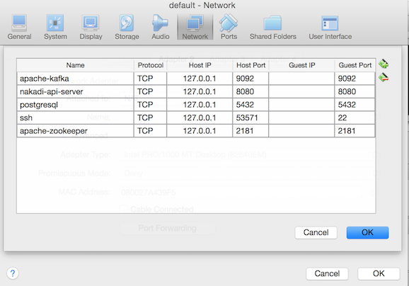

# Getting Started

In this section we'll walk through running a Nakadi service on your machine. Once you have the service up and running, you can jump to [Using Nakadi]() to see how produce and consume messages.

## Quickstart

You can run a Nakadi service locally using Docker. If you don't have Docker installed, there are great instructions available on [the Docker website](https://www.docker.com/). 


### Running a Server

From the project's home directory you can install and start a Nakadi container via the `gradlew` command:

```sh
./gradlew startDockerContainer
```

This will start a docker container for the Nakadi server and another container 
with its PostgreSQL, Kafka and Zookeeper dependencies. 

### Stopping a Server

To stop the running Nakadi:

```sh
./gradlew stopAndRemoveDockerContainer
```

---

### Notes

#### Ports

Some ports need to be available to run the service: 

-  8080 for the API server
-  5432 for PostgreSQL
-  9092 for Kafka 
-  2181 for Zookeeper 
  
They allow the services to communicate with each other and should not be used by other applications. If you're running Docker on a Mac, take a look at [Mac OS and Docker]() below.

#### Gradle and the Gradle Wrapper

The `gradlew` command is a Gradle "wrapper" script. A [Gradle wrapper](https://docs.gradle.org/current/userguide/gradle_wrapper.html) is tied to a specific version of Gradle, so when you first run one of the commands above, it will download the corresponding Gradle distribution and use it to execute the command.

#### Mac OS and Docker

Since Docker for Mac OS runs inside Virtual Box, you will  want to expose 
some ports first to allow Nakadi to access its dependencies -

```sh
docker-machine ssh default \
-L 9092:localhost:9092 \
-L 8080:localhost:8080 \
-L 5432:localhost:5432 \
-L 2181:localhost:2181
```

Alternatively you can set up port forwarding on the "default" machine through 
its network settings in the VirtualBox UI, which look like this - 





#### Docker Not Running

If you get the message "Is the 
docker daemon running on this host?" but you know Docker (and/or VirtualBox) are 
running, you might want to run this command - 

```sh
eval "$(docker-machine env default)"
```
