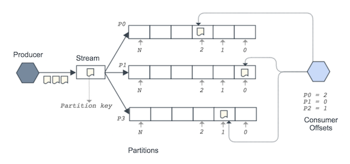

# Using Nakadi

## Nakadi Concepts

The Nakadi API allows the publishing and consuming of _events_ over HTTP. 
To do this an _owning application_ must register an _event type_ with the Nakadi schema registry. The event type contains information such as the name, the owning application, strategies for partitioning and enriching data, and a JSON schema. Once the event type is created, a publishing resource called a _stream_ becomes available that will accept events for the type from a _producer_ and can be read from by one or more _consumers_. 

Clients of Nakadi can be grouped as follows: 

- **Event Type Owners**: Event Type owners interact with Nakadi via the _Event Type Registry_ to define event types. 

- **Event Producers**: Producers post events to the event type's publishing resource. to generate an event stream.
 
- **Event Consumers**: Consumers read events from the event stream. Multiple consumers can read from the same stream.


## Defining Event Types

### Event Type Categories

There are three main _categories_ of event type defined by Nakadi - 

- **Undefined**: a free form category suitable for events that are entirely custom to the producer.

- **Data**: an event that represents a change to a record or other item, or a new item. Change events are associated with a create, update, delete, or snapshot operation. 

- **Business**: an event that is part of, or drives a business process, such as a state transition in a customer order. 

The events for the 'business' and 'data' helper categories follow a 
generic Nakadi event schema as well as a schema custom to the event data. The 
generic schema pre-defines common fields for an event and the custom schema 
for the event is defined when the event type is created. When an event for 
one of these categories is posted to the server, it is expected to conform to 
the combination of the generic schema for the category and to the custom schema defined for the event type. This combination is called the _effective schema_ and is validated by Nakadi.

The 'undefined' category is also required to have a JSON schema on creation, 
but this can be as simple as `{ "\additionalProperties\": true }` to allow 
arbitrary JSON. Unlike the 'business' and 'data' categories, the schema for an 
'undefined' type is not checked by Nakadi when an event is posted, but it can 
be used by a consumer to validate data on the stream.

### Creating an Event Type

An event type can be created by posting to the `/event-types` resource. 

This example shows a `business` category event type called `order_received` 
which has a simple schema describing the `order number` -

```sh
curl -v -XPOST http://localhost:8080/event-types -d '{
  "name": "order_received",
  "owning_application": "order-service",
  "category": "business",
  "partition_strategy": "random",
  "enrichment_strategies": ["metadata_enrichment"],
  "schema": {
    "type": "json_schema",
    "schema": "{ \"properties\": { \"order_number\": { \"type\": \"string\" } } }"
  }
}'
```

A successful request will result in a `201 Created` response. The exact required 
fields depend on the event type's category, but `name`, `owning_application` and 
`schema` are always expected.

Note that the `schema` value should only declare the custom part of the 
event - the generic schema is implicit and doesn't need to be defined. The 
combination of the two is called the _effective schema_ will be checked 
when events are submitted for the event type.

Once an event type is created, it is added to the _event type registry_ and its details are visible from its URI in the registry. Events can then be posted to its stream and consumed by multiple clients. The 
["API Reference"](./api-reference.html) contains more details on creating and managing event types.

### Partitions

An event type's stream is divided into one or more _partitions_ and each event is placed into exactly one partition. Partitions preserve the order of events - once an event is added to a partition its position relative to other events in the partition is never changed. The details of the partitions and their offsets for an event type are available via its `/partitions` resource.

Each partition is a fully ordered log, and there is no global ordering across partitions. Clients can consume a stream's partitions independently and track their position across the stream.



Dividing a stream this way allows the overall system to be scaled and provide 
good throughput for producers and consumers. It's similar to how systems such as [Apache Kafka](http://kafka.apache.org/documentation.html#intro_topics) and AWS Kinesis work. 

The assignment of events to a partition is controllable by the producer. The 
`partition_strategy` field determines how events are mapped to partitions. Nakadi offers the following strategies:

- `random`: the partition is selected randomly and events will be evenly distributed across partitions.

- `user_defined`: the partition is set by the producer when sending an event. This option is only available for the 'business' and data' categories.

- `hash`: the partition is selected by hashing the value of the fields
  defined in the event type's `partition_key_fields`. In practice this means events that are about the same logical entity and which have the same values for the partition key will be sent to the same partition.

@@@todo: example with hash 


## Sending an Event to a Stream

One or more events can be published by posting to the event type's events 
collection. This example posts two events to the `order_received` stream:

```sh
curl -v -XPOST http://localhost:8080/event-types/order_received/events -d '[
  {
    "order_number": "24873243241",
    "metadata": {
      "eid": "d765de34-09c0-4bbb-8b1e-7160a33a0791",
      "occurred_at": "2016-03-15T23:47:15+01:00"
    }
  }, {
    "order_number": "24873243242",
    "metadata": {
      "eid": "a7671c51-49d1-48e6-bb03-b50dcf14f3d3",
      "occurred_at": "2016-03-15T23:47:16+01:00"
    }
  }]'


HTTP/1.1 200 OK  
```

As shown above, the event stream accepts an array of events. 

### Event Validation and Effective Schema

Each event sent to the stream can be validated relative to the _effective schema_ for the event type. 

The validation behaviour and the effective schema varies based on the event type's category. For example, because the example above is a 'business' category event type, as well as the fields defined in the event type's original schema, the events must also contain a `metadata` object with an `eid` and `occurred_at` fields in order to conform to the standard structure for that category. The 'data' category has a similar but slightly different structure for its effective schema compared the 'business' category. Both of these categories will have their events validated by Nakadi.

The 'undefined` category behaves slightly different to the other categories. In principle its effective schema is exactly the same as the one created with its event type definition (it has no extra structure), but it is **not** validated by Nakadi. Instead an 'undefined' event type's schema is simply made 
available in the event type registry for consumers to use if they wish.

Once the event is validated, it is placed into a partition and made available 
to consumers. If the event is invalid, it is rejected by Nakadi.

@@@todo: image for effective schema


### Event Ordering

The order of events in the posted array will be the order they are 
published onto the event stream and seen by consumers. They are not re-ordered 
based on any values or properties of the data. 

Nakadi preserves the order of events sent to it (the "arrival order"), but has 
no control over the network between it and the producer. In some cases it 
may be possible for events to leave the producer but arrive at Nakadi in a 
different order (the "delivery order"). Not all events need ordering guarantees but producers that do need end to end ordering have a few options they can take:

 - Wait for a response from the Nakadi server before posting the next event. This trades off overall producer throughput for ordering.
 
 - Use the `parent_eids` field in the 'business' and 'data' categories. This acts as a causality mechanism  by allowing events to have "parent" events. Note the `parent_eids` option is not available in the 'undefined' category. 

- Define and document the ordering semantics as part of the event type's scheme definition such that a consumer could use the information to resequence events at their end.


## Consuming Events

### Connecting to a Stream

A consumer can open the stream for an Event Type via the `/events` sub-resource. For example to connect to the `order_received` stream send a GET request to its stream as follows:

```sh
curl -v http://localhost:8080/event-types/order_received/events 
```

The stream accepts various parameters from the consumer, which you can read about in the ["API Reference"](./api-reference.html). In this section we'll just describe the response format, along with how cursors and keepalives work.

### HTTP Event Stream

The HTTP response on the wire will look something like this (the newline is show as `\n` for clarity):

```sh
curl -v http://localhost:8080/event-types/order_received/events 
    

HTTP/1.1 200 OK
Content-Type: application/x-json-stream

{"cursor":{"partition":"0","offset":"6"},"events":[...]}\n
{"cursor":{"partition":"0","offset":"5"},"events":[...]}\n
{"cursor":{"partition":"0","offset":"4"},"events":[...]}\n
```

Nakadi groups events into batch responses (see the next section, "Batch Responses" for some more details). Batches are separated by a newline and each available batch will be emitted on a single line. If there are no new batches the server will occasionally emit an empty batch (see the section "Event Stream Keepalives" further down).

Technically, while each batch is a JSON document, the overall response is not valid JSON. For this reason it is served as the media type `application/x-stream-json` rather than `application/json`. Consumers can use the single line delimited structure to frame data for JSON parsing.

### Batch Responses

A pretty-printed batch object looks like this -

```json
{
  "cursor": {
    "partition": "0",
    "offset": "4"
  },
  "events": [...]
} 
```

Each batch belongs to a single partition. The `cursor` object describes the partition and the offset for this batch of events. The cursor allow clients to checkpoint their position in the stream's partition. Note that individual events in the stream don't have cursors, they live at the level of a batch. 

The `events` array contains a list of events that were published in the order they arrived from the producer. Note that while the producer can also send batches of events, there is no strict correlation between the batches the consumer is given and the ones the producer sends. Nakadi will regroup events send by the producer and distribute them across partitions as needed.

### Cursors, Offsets and Partitions

By default the `events` resource will return data from all partitions of an event type stream and will do so from the end (or "tail") of the stream. To select only particular partitions and a position in the stream to start, you can supply an `X-Nakadi-Cursors` header in the request:

```sh
curl -v http://localhost:8080/event-types/order_received/events \
  -H 'X-Nakadi-Cursors: [{"partition": "0", "offset":"12"}]'
```

The `X-Nakadi-Cursors` header value is a JSON array of _cursors_. Each cursor in the array describes its partition for the stream and an offset to stream from. 

The `offset` value of the cursor allows you select where in the stream partition you want to consume from. This can be any known offset value, or the dedicated value `begin` which will start the stream from the beginning. For example, to read from partition `0` from the beginning:

```sh
curl -v http://localhost:8080/event-types/order_received/events \
  -H 'X-Nakadi-Cursors:[{"partition": "0", "offset":"begin"}]'
```


#### Event Stream Keepalives

If there are no events to be delivered the server will keep a streaming connection open by periodically sending a batch with no events but which contains a `cursor` pointing to the current offset. For example:

```sh
curl -v http://localhost:8080/event-types/order_received/events 
      

HTTP/1.1 200 OK
Content-Type: application/x-json-stream

{"cursor":{"partition":"0","offset":"6"},"events":[...]}\n
{"cursor":{"partition":"0","offset":"6"}}\n
{"cursor":{"partition":"0","offset":"6"}}\n
{"cursor":{"partition":"0","offset":"6"}}\n
```

This can be treated as a keep-alive control.


